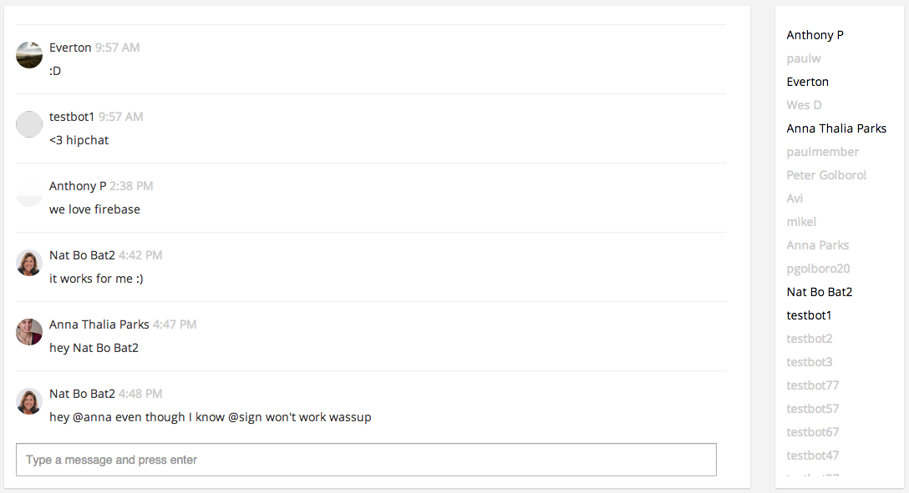

Basic workspace-level chat plugin using Firebase to store the chat messages

## Installation
- Create a plugin with a name and namespace. 
- Find and replace the word 'namespaced' with your new namespace.
- Copy and paste the updated contents of each file into their respective places in the plugin editor of the Zengine developer tool. 
- In Firebase, create a new app. 
- Copy and paste the contents of the security.json file into the security rules section of your Firebase app dashboard.
- In the publishing settings of the Zengine developer tool, update the Firebase URL and Firebase secret key. 
