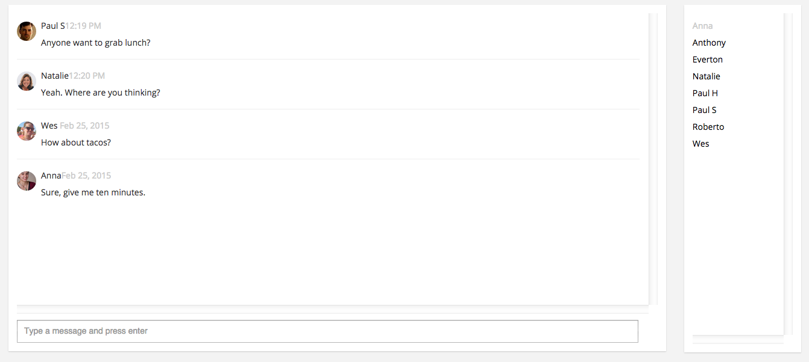

Basic workspace-level chat plugin using Firebase to store the chat messages

## Installation
Do a find-replace on 'namespaced' with a namespace of your choosing. Create a plugin with that namespace and copy-paste the contents of each file into their respective files in the plugin developer tool.
