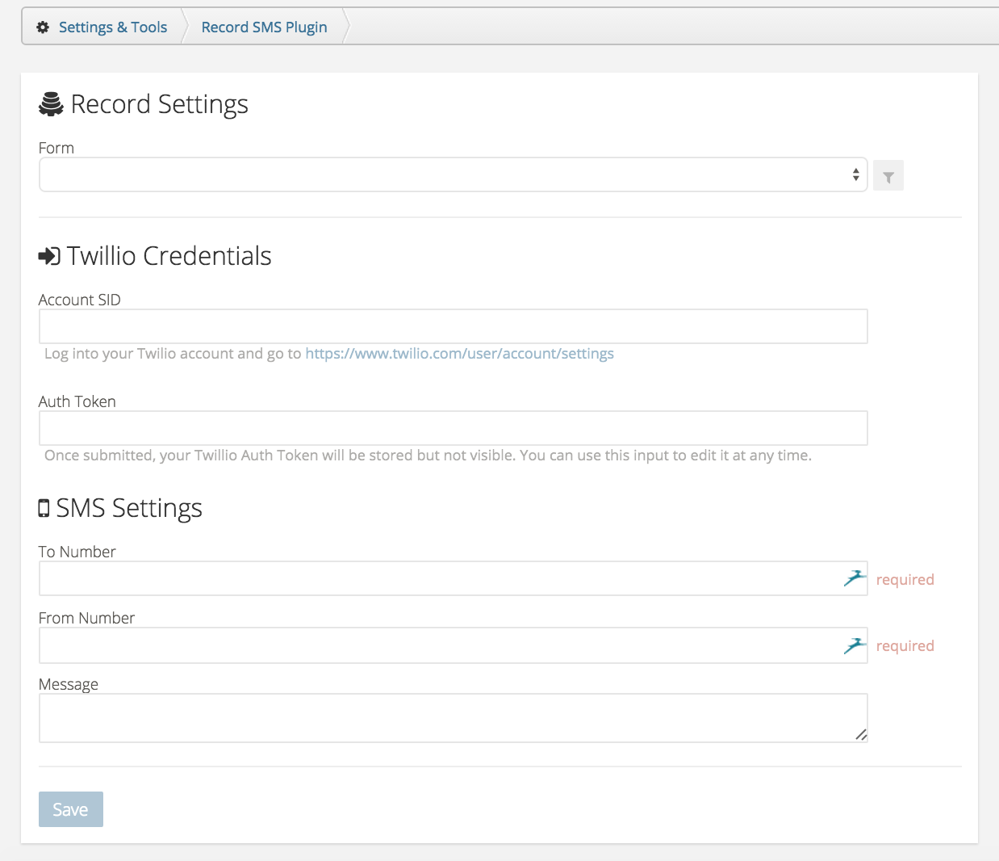

Plugin Services allow you to run backend code, including communicating with other APIs. Webhooks allow you to execute webhook URLs when certain workspace data is created, updated, or deleted. This example is a plugin service that sends a text message via Twillio everytime a record is created.

## Installation
1. Create a plugin and a plugin service.
2. Find and replace the word 'namespaced' with your new namespace in your frontend code. Replace the word 'sms-messages' with the route of your new plugin service.
3. Copy and paste the updated contents of each file into their respective places in the frontend code editor of the Zengine developer tool.
2. Download the service draft source and replace the plugin.js with the plugin.js file in the backend folder.
3. Save the updated file, rezip the service folder, and reupload to your plugin service.
4. Publish your plugin, and install it into your workspace.
5. Go to the settings panel to setup your webhook and Twillio credentials.