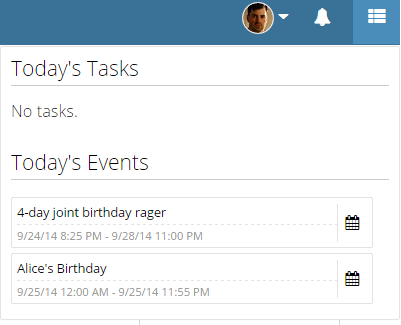

Simple inline plugin that displas a list of items (tasks and events) for you to focus on today

## Installation

1. Create a plugin with a name and namespace. 
2. Find and replace the text 'todaySummary' in JavaScript, and 'today-summary' in HTML, with your new namespace.
3. Copy and paste the updated contents of each file into their respective places in the plugin editor of the Zengine developer tool.
4. Set the Activation Type to 'User' in the Zengine developer tool Publishing Settings.

